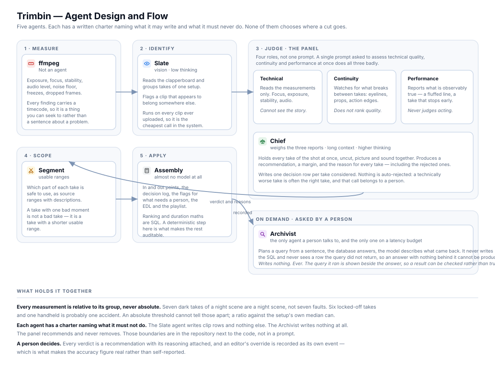

# Agents

Five agents. Each has a written charter in the repository, beside its code, naming
what it may write and what it must never do. Those boundaries are not in a prompt,
because a prompt is not a contract.

Model identifiers live in one configuration module rather than at call sites.
Choosing a model is a decision with a cost attached, and it should be visible in
one place.

---

## Slate — identify

**Reads** the clapperboard in each clip, groups takes belonging to the same setup,
and flags a clip that appears to belong somewhere else.

**Writes** clip rows. Nothing else.

Vision, low thinking level, low media resolution — deliberately the cheapest call
in the system, because it runs on every clip ever uploaded. This is closer to OCR
than to judgement, and raising either setting would multiply the bill across the
whole archive to read six characters off a board.

**It proposes; it never decides.** A slate reading becomes canonical placement only
when a person settles it. When there is no board, it says so rather than guessing —
those clips arrive as unassigned footage for somebody to place.

## Analyst — judge

The only agent that makes a judgement, and it is four roles rather than one prompt.
A single prompt asked to assess technical quality, continuity and performance
simultaneously does all three badly.

**Technical** reads the measurements only — focus, exposure, stability, audio. It
cannot see the story, and does not pretend to.

**Continuity** watches what breaks between takes: eyelines, props, the edges of an
action. It does not rank quality.

**Performance** reports what is observably true — a fluffed line, a take that stops
early, an exchange clipped by the camera cutting. **It never judges acting.**

**The chief** weighs the three reports. Long context and a higher thinking level,
because comparing seven takes properly means holding all seven in mind at once,
picture and sound together, uncut.

**Writes** one decision row per take considered, each with the reason recorded at
the time — including for the takes that were not chosen.

Nothing is auto-rejected. The panel recommends and never removes.

## Segment — scope

Marks which parts of each take are usable, as source ranges with descriptions.

A take with one bad moment is not a bad take; it is a take with a shorter usable
range. Take 4 with a continuity break at 00:34 still has 34 clean seconds, and
throwing away the whole take to avoid the last of it is how usable material becomes
unusable material.

## Assembly — apply

The deliberately boring agent, and almost no model at all.

It sits between AI judgement and what the editor sees: in and out points, the
decision log, the flags for what needs a person, the EDL and the streaming
playlist. Ranking, thresholding, sorting and duration arithmetic are SQL. Asking a
language model to compare two numbers is slower, more expensive and less reliable
than comparing them.

**A deterministic, auditable step at this boundary is what makes the rest of the
pipeline trustworthy.** One short model call phrases the review summary; everything
that affects an outcome is arithmetic.

## Archivist — ask

The only agent a person talks to directly, and the only one on a user-facing
latency budget.

The shape is: **the model plans, the database answers, the model describes what
came back.** It never writes the query and never sees a row the query did not
return — so an answer with nothing behind it is not something it can produce. The
schema it replies with has no field to put a take in.

**Writes nothing. Ever.** It runs as a read-only database user whose inability to
write is verified on every deploy.

It takes no video input. By the time a question is asked, every clip has already
been watched, measured and described, so search runs over what was recorded rather
than over the footage — which is why an answer takes about a second instead of a
minute.

The query it ran is shown beside the answer. A result somebody can check is worth
more than one they have to trust, and that is this system's whole argument.

---

## What holds it together

### Measurement is relative, never absolute

Seven dark takes of a night scene are a night scene, not seven faults. Six
locked-off takes and one handheld is probably one accident. A ratio against the
setup's own median is the only question worth asking: *is this take unlike its
siblings?*

There is a real failure mode here that the code guards explicitly. If a group has
no raw measurements at all, normalising it would compute a median of zero on every
axis, fall back to a neutral ratio everywhere, and flatten twelve correctly
measured takes into "all typical" — a placeholder that looks exactly like a real
answer. That case is detected and refused rather than written.

### Findings are events, not spans

A camera settling after a knock throws a motion spike every few tenths of a second.
Written out one per span, that became fourteen findings on one take, each
describing part of the same bump. Spans within a second of each other merge into
one event; ten seconds apart stays two, because that is two things happening.

### An honest empty

A failed search says it failed. Dressed as an empty result, it would tell somebody
their archive contains nothing — a different and wrong thing.

When a query returns no rows, near misses are offered *labelled as near misses*,
never substituted. Somebody who asked about scene 12 would act on rows from scene 9
without noticing they were not what they asked for.

### A person decides, and the disagreement is the measurement

Every verdict is a recommendation with its reasoning attached. An editor's override
is recorded as its own event beside the recommendation rather than replacing it.

That is where the published accuracy figure comes from: the share of confident
decisions no editor later replaced, counted from the event log. Shots the system
flagged for review are excluded, because those were handed to a person
deliberately. Nothing is self-reported, and the figure is not calculated by the
component being measured.
