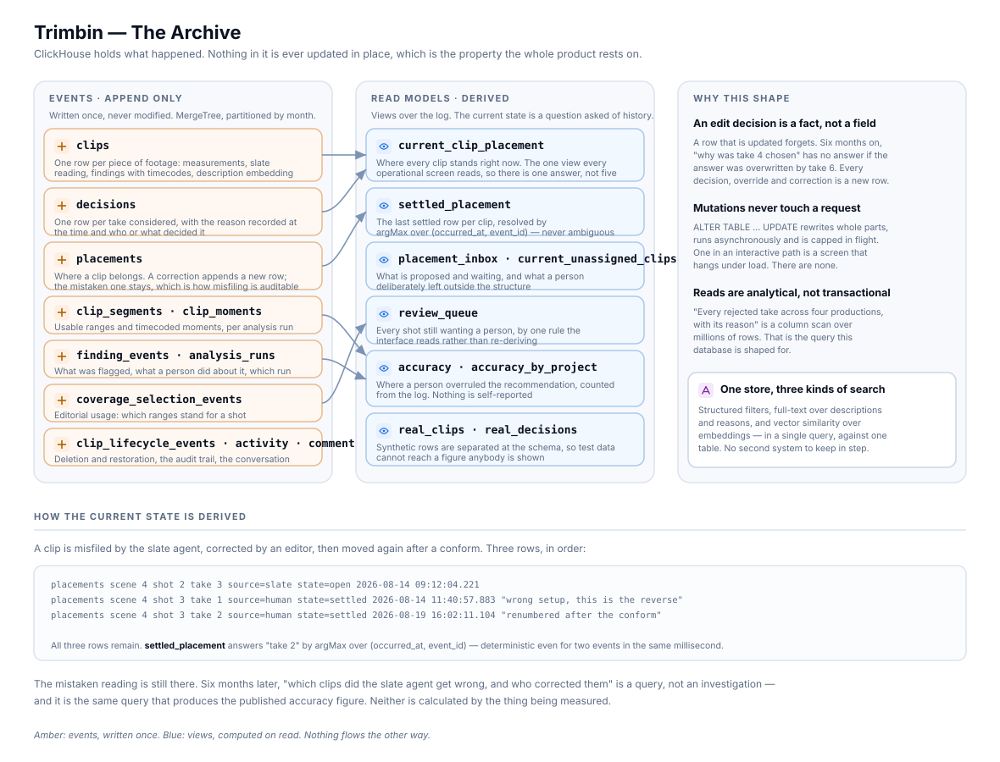

# The archive



ClickHouse holds what happened. Nothing in it is ever updated in place, and that
single property is what the product rests on.

## Why an edit decision is a fact, not a field

A row that is updated forgets.

Store "the selected take for shot 3" as a field and set it to 6, and the question
*why was take 4 chosen* has no answer six months later — the answer was overwritten.
Store each decision as a row and the history is the data. Take 4 was recommended by
the panel at 11:04 with its reasoning. An editor replaced it with take 6 at 16:22
with theirs. Both are still there.

Every correction appends. A misfiled clip that gets moved leaves the mistaken
placement on the record beside the fix, with who corrected it and when. That is not
an audit feature bolted on — it is the same mechanism that produces the current
state.

## The tables

### Events — written once

| Table | What it records |
|---|---|
| `clips` | One row per piece of footage: measurements, slate reading, findings with timecodes, description embedding |
| `decisions` | One row per take considered, with the reason recorded at the time and who or what decided |
| `placements` | Where a clip belongs. A correction appends; the mistaken row stays |
| `clip_segments` · `clip_moments` | Usable ranges and timecoded moments, per analysis run |
| `finding_events` · `analysis_runs` | What was flagged, what a person did about it, which run produced it |
| `coverage_selection_events` | Editorial usage — which ranges stand for a shot, including per-range reason, origin and author |
| `clip_lifecycle_events` | Deletion and restoration as states, not as absence |
| `activity` · `comments` | The audit trail and the conversation |

MergeTree, partitioned by month, ordered so the common read is a range scan.

### Read models — computed

| View | What it answers |
|---|---|
| `current_clip_placement` | Where every clip stands right now. **The one view every operational screen reads** |
| `settled_placement` | The last settled row per clip |
| `placement_inbox` · `current_unassigned_clips` | What is proposed and waiting; what a person deliberately left outside the structure |
| `review_queue` | Every shot still wanting a person |
| `accuracy` · `accuracy_by_project` | Where a person overruled the recommendation |
| `real_clips` · `real_decisions` | Everything above, with synthetic rows excluded |

## How current state is derived

A clip is misfiled by the slate agent, corrected by an editor, then renumbered
after a conform. Three rows:

```
placements  scene 4  shot 2  take 3  source=slate  state=open      2026-08-14 09:12:04.221
placements  scene 4  shot 3  take 1  source=human  state=settled   2026-08-14 11:40:57.883  "wrong setup, this is the reverse"
placements  scene 4  shot 3  take 2  source=human  state=settled   2026-08-19 16:02:11.104  "renumbered after the conform"
```

All three remain. `settled_placement` answers *take 2*:

```sql
argMax(take_no, tuple(occurred_at, event_id))
```

The tuple matters. Ordering by timestamp alone is ambiguous for two events in the
same millisecond, and a placement that resolves differently on two reads is a
placement nobody can trust. Adding `event_id` makes it total.

Six months later, *which clips did the slate agent get wrong, and who corrected
them* is a query rather than an investigation — and it is the same query that
produces the published accuracy figure.

## Mutations are never in an interactive path

`ALTER TABLE … UPDATE` rewrites whole parts, runs asynchronously, and is capped in
flight. One in a request handler is a screen that hangs under load, intermittently,
in a way that gets worse as the archive grows.

There are none. A test asserts that no service module contains one, because this is
exactly the kind of rule that erodes quietly — somebody fixes a bug with an
`UPDATE`, it works on a small table, and it is a latent outage.

Where a value genuinely needs correcting, a new event is appended and the view
resolves it. That is slower to write and enormously cheaper to run.

## One store, three kinds of search

A question like *"which takes were rejected for continuity in scene 12"* needs
three things at once: structured filters on scene and outcome, full-text over
reasons and descriptions, and vector similarity when the question describes what
the footage looks like rather than naming it.

All three run against one table in one query. Skipping indexes on the embedding,
the description and the duration keep it from scanning — and the deploy verifies
those indexes exist on the table rather than trusting that they exist in the
migration file.

That distinction was earned. A vector index sat declared in a migration and absent
from the table for weeks while every deploy reported success, because the verifier
counted tables and never counted indexes. A declaration nothing compares against is
a claim, not a schema.

## Real and synthetic are separated at the schema

Test data must never reach a figure anybody is shown, public or private.

Rather than filtering in application code — which works until one query forgets —
the separation is a pair of views. `real_clips` and `real_decisions` exclude
synthetic rows, and the application reads those. A query that forgets the filter
reads a view that already has it.

Where there is no data, the interface shows zero or nothing. It never displays a
plausible number it cannot source.

## Reads are analytical

*Every rejected take across four productions with its reason and its timecode* is a
column scan over millions of rows returning a few hundred. That is the query this
database is shaped for, and it is the query the product is made of — not point
lookups by key, which is why operational state lives in Firestore instead.

## Guarded joins

One production defect is worth naming, because it is subtle and it fabricated data.

ClickHouse's `join_use_nulls=0` means a missing right-hand side in a `LEFT JOIN`
does not produce NULL — an absent Enum column defaults to its **first value**. For
the decision outcome enum, that first value is `selected`.

So a clip with no decision row at all joined to a phantom outcome of *selected*.
Every `ifNull` guard written against it never fired, and search returned takes
labelled as chosen that nothing had ever chosen. The interface then compounded it
by attributing that phantom to a reviewer.

The fix is an explicit `has_decision` flag on the join, checked before the outcome
is read, and a test that counts guards against joins so a new one cannot be added
without one.
