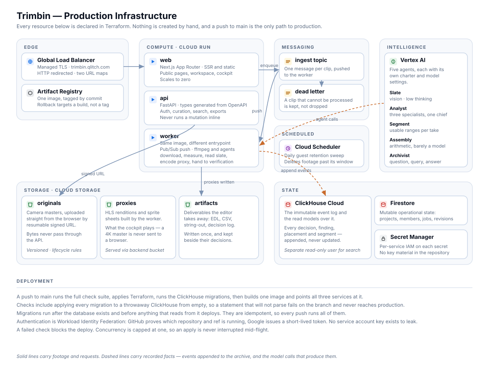
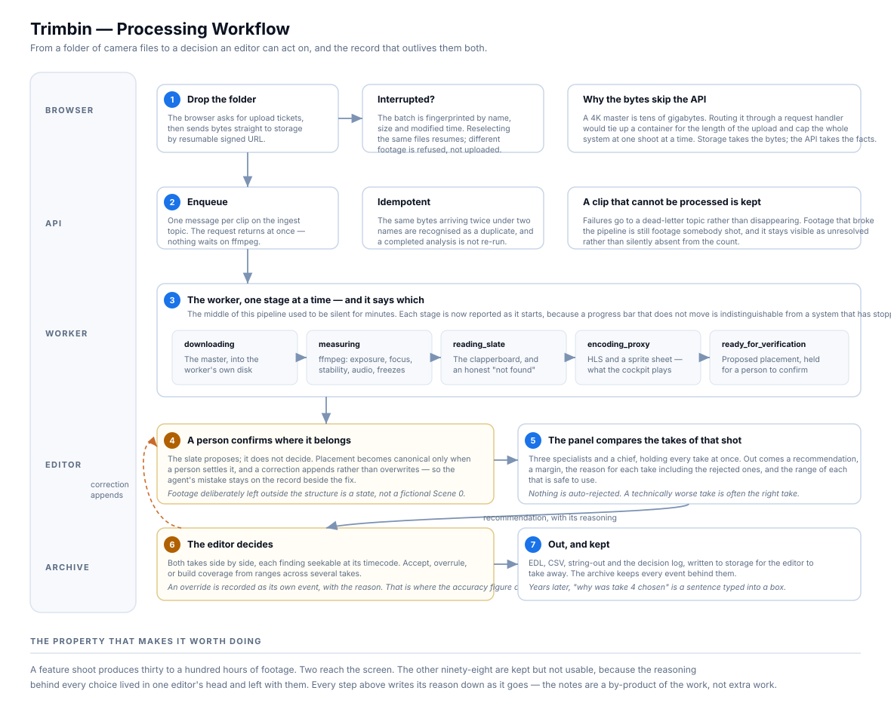

# Infrastructure



Everything below is declared in Terraform. Nothing is created by hand in a console,
and a push to `main` is the only path to production.

## What is deployed

### Edge

**Global Load Balancer** with a managed TLS certificate, serving
`trimbin.qlitch.com`. Two URL maps — one for HTTPS, one redirecting plain HTTP.
Proxies are served through a backend bucket rather than the application, so
streaming a take does not occupy a request handler.

**Artifact Registry** holds one image, tagged both `latest` and with the commit
SHA. A rollback targets a specific build rather than a moving tag.

### Compute — Cloud Run

| Service | Notes |
|---|---|
| `web` | Next.js App Router. Scales to zero between sessions. |
| `api` | FastAPI. Authorisation, curation, search, exports. |
| `worker` | Same image, command overridden. ffmpeg and the agents. |

Each runs as its own service account with only the permissions it needs. The
worker can write to storage and the archive; the API cannot run ffmpeg; nothing
holds a broader role because it was convenient.

### Messaging

**Ingest topic**, one message per clip, delivered by push subscription to the
worker. **Dead-letter topic** for anything that cannot be processed — footage that
broke the pipeline is still footage somebody shot, and it stays visible as
unresolved rather than silently missing from a count.

### Storage

| Bucket | Contents |
|---|---|
| `originals` | Camera masters. Uploaded direct from the browser by resumable signed URL; bytes never pass through the API. Versioned, with lifecycle rules. |
| `proxies` | HLS renditions and sprite sheets. What the cockpit actually plays — a 4K master is never sent to a browser. |
| `artifacts` | Deliverables the editor takes away: EDL, CSV, string-out, decision log. |

### State

**ClickHouse Cloud** — the event log and the read models over it. A separate
read-only user with its own resource limits exists for search.

**Firestore** — mutable operational state: projects, membership, jobs, revisions.

**Secret Manager** — five secrets with per-service IAM. No key material in the
repository, and a secret scan runs on every push.

### Scheduled

**Cloud Scheduler** runs the guest retention sweep daily, deleting footage past its
window. Daily rather than hourly: the window is measured in days, so an hourly
sweep would run twenty-four times to find nothing twenty-three of them.

---

## How a change reaches production



```
push to main
   │
   ├─ Checks ─────────────────────────────────────────────
   │    API tests · Agent tests · Lint and format
   │    Frontend tests · Typecheck · Production build
   │    Terraform validate · Secret scan
   │    Migrations applied to a throwaway ClickHouse from empty
   │
   ├─ Terraform apply           the registry and secrets must exist first
   ├─ ClickHouse migrations     after the database, before anything reads it
   ├─ Build and push one image  tagged latest and by commit
   └─ Deploy api · worker · web  all three pointed at the same tag
```

A failed check blocks the deploy. Concurrency is capped at one, so an apply is
never interrupted mid-flight.

### Authentication has no keys

Workload Identity Federation: GitHub proves which repository and which ref is
running, and Google issues a short-lived token in response. **No service account
key exists anywhere** to leak, to rotate, or to find in a git history two years
from now.

### Migrations

Idempotent, applied in order, run on every push. They execute after the database
exists and before anything that reads from the schema deploys.

`migrate.sh` does its own verification once applied, and it checks more than
whether statements ran:

- The expected schema objects are present.
- The canonical placement view has its contract columns **and answers a real
  application predicate** — a view whose columns were stored under qualified names
  still shows as existing in `system.tables` while every query against it fails.
- Skipping indexes exist **on the tables**, not merely in the migration files.
- The read-only user can read, and — checked explicitly — **cannot write.**

That last one is the boundary that matters when a model is involved in composing a
query. A grant that looks correct and is not would undo it silently.

### Migrations are validated before production

CI applies every migration to a ClickHouse service container, from empty, and runs
the same verification against it.

This gate exists because its absence cost a deploy. Migration 024 declared a view
ClickHouse refuses to parse — `max(occurred_at) AS occurred_at` shadowed the column
that an `argMax` ordering tuple read, making it an aggregate inside an aggregate.
Numbering was checked; the SQL never was, and the first parser to see it was
production's.

It failed safely by ordering alone: the bad statement sat above the three `DROP`
statements in the same file, so the existing views survived and production stayed
on its previous revision. Reversed, every operational screen would have been
reading a view that no longer existed.

The gate now runs on a fresh server each time, which also proves the schema builds
from nothing rather than merely surviving on top of what production already has.

---

## When something fails

| Failure | Behaviour |
|---|---|
| A clip breaks ffmpeg | Dead-letter topic; the clip stays visible as unresolved footage |
| The same footage is uploaded twice | Fingerprinted by content and flagged as a duplicate, not ingested again |
| A model call fails | The rows are still the answer; a plain sentence replaces the written one |
| Search is unavailable | Said plainly, never rendered as an empty archive |
| A migration will not parse | The branch fails; it cannot reach production |
| A bad build ships | Roll back to a specific commit-tagged image |
| An apply is interrupted | Cannot happen — concurrency is capped at one |

## What the release gate does not cover

`tools/release-check.sh` runs eleven of these gates locally — all but the secret
scan and the ClickHouse container, which need more than a laptop — and prints what
it **cannot** check:

- A browser pass over every route including a shot URL. A green build says nothing
  about a runtime error in a hook — the build and the typechecker are both blind to
  it.
- A public project a signed-out visitor can actually open. That is data, not code.
- Migrations applied against production.

A check that implies more than it verified is worse than no check, so these are
named rather than left to be assumed.
